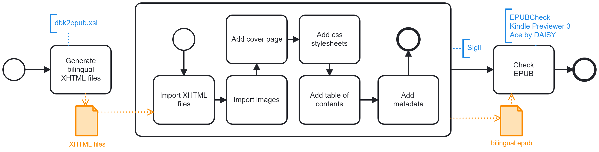

# Generate EPUB
Procedure to transform a bilingual DocBook into a reflowable EPUB file.

- Using XSLT/XPATH for Visual Studio Code, apply the stylesheet dbk2epub.xsl and transform the DocBook bilingual.dbk into a set of XHTML content files.
- Using [Sigil](https://sigil-ebook.com/), initalize an EPUB3 bilingual.epub file and:
  1. Import the content XHTML files.
  2. Import the image files.
  3. Add the book cover.
  4. Add the CSS stylesheets.
  5. Add the table of contents.
  6. Add the EPUB file metadata.
- Using [EPUBCheck](https://www.w3.org/publishing/epubcheck/), [Amazon Kindle Previewer 3](https://www.amazon.com/Kindle-Previewer/b?node=21381691011) and [Ace by DAISY](https://daisy.org/activities/software/ace/), check the EPUB file format.

## Limitations
- The stylesheet dbk2epub.xsl covers only a small subset of the DocBook 5.0 specification.
