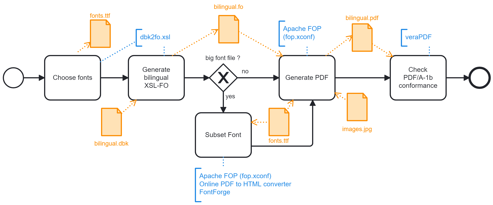

- Choose fonts according to your project, get the corresponding TTF files and adjust fop.xconf and dbk2fo.xsl accordingly.
Note: Check the licence of the fonts before using them
- Using XSLT/XPATH for Visual Studio Code, apply the stylesheet dbk2fo.xsl and transform the DocBook bilingual.dbk into the XSL-FO bilingual.fo
Note: the stylesheet covers only a small subset of the DocBook 5.0 specification. For details about the supported scope, refer to the sample dataset.
- Optionally, for Chinese or Japanese fonts, create a smaller subset font file:
  1. Using Apache FOP, generate a PDF file embedding the font subset.
  2. Using [IDR Solutions Online PDF to HTML Converter](https://www.idrsolutions.com/online-pdf-to-html5-converter) get the font subset in WOFF format.
  3. Using FontForge, generate the subset TTF font file:
    - Encoding > Compact
    - Element > Font Info > Update Fontname
    - File > Generate Font

  Note: By producing a subset font file that can then be included in full into the PDF file, this step is indeed a trick enabling to generate in the next step a file compliant with PDF/A-1b format, while embedding a font that contains more than 8191 glyphs. Besides, it reduces the size of the final PDF file by a couple of megabytes per font file.
- Using Apache FOP 2.8, transform the XSL-FO bilingual.fo into the PDF bilingual.pdf (embedding all fonts in full)
- Using [veraPDF](https://verapdf.org/), check conformance to PDF/A-1b format
