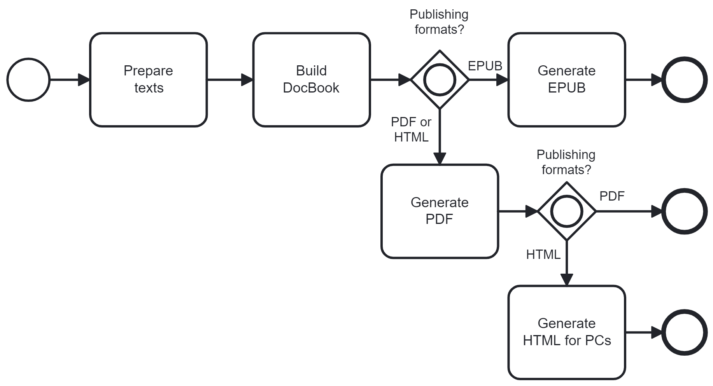

# bilingual-ebooks
Publishing chain for bilingual ebooks (EPUB and PDF) based on translation memory TMX and DocBook

- Prepare texts
- Build DocBook
- [Generate EPUB](https://github.com/japotrad/bilingual-ebooks/blob/main/3.%20Generate%20EPUB/README.md)
- [Generate PDF](https://github.com/japotrad/bilingual-ebooks/blob/main/3.%20Generate%20PDF/README.md)
- Generate paged HTML for personal computers using [IDR solutions' Online PDF to HTML5 Converter](https://www.idrsolutions.com/online-pdf-to-html5-converter)

## Limitations
- Only a small subset of the DocBook format is supported. For details about the supported scope, refer to the sample dataset.
- As of September 2023, the generated EPUBs do not play well in Google Books.

## Published bilingual books
**French books for Japanese speakers**
- *Pêcheur d'Islande*, 19th-century novel about fishermen in Brittany, written by Pierre Loti and translated by Takamatsu Yoshie.

## References
Oliver González, A. (2017). «InLéctor: automatic creation
of bilingual e-books ». *Revista Tradumàtica*. Tecnologies de la Traducció, 15,
21-47. https://doi.org/10.5565/rev/tradumatica.191
